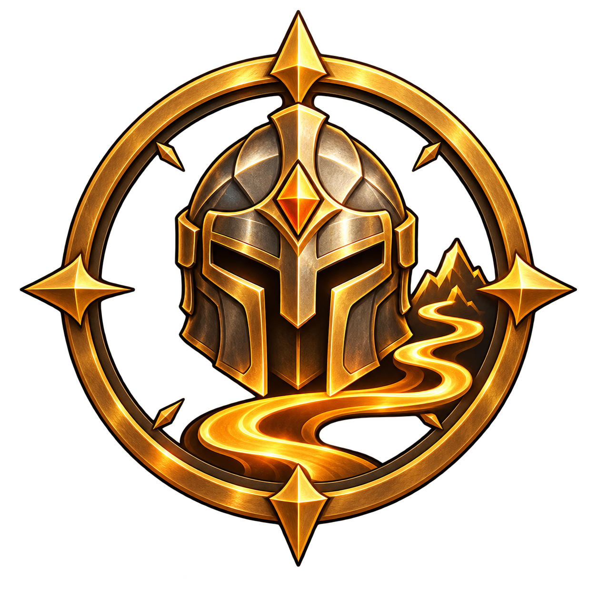

<p align="center">
  
</p>

<h1 align="center">Ironman Guide</h1>

<p align="center">
  A step-by-step RuneLite progression guide for Old School RuneScape Ironman accounts.
</p>

<p align="center">
  <strong>One continuous Ironman route, guided in-game like a giant Quest Helper.</strong>
</p>

---

## About

**Ironman Guide** is a RuneLite plugin built to turn an Ironman progression route into one continuous guided experience.

Instead of constantly switching between a browser guide, the OSRS Wiki, notes, and RuneLite, the plugin aims to keep the route inside the client and guide the player step by step.

The long-term goal is simple:

> Create a fresh Ironman, enable Ironman Guide, and follow the route from early game through late game without already needing to know what comes next.

The project is currently in active development.

## Current progress

The route currently contains **55 ordered guide steps**.

Implemented sections:

- Starting off
- Lumbridge setup
- Training and preparation
- Leaving Lumbridge
- Draynor and X Marks
- Falador and Ferox
- Yanille and Port Khazard

Current progression includes early account setup, early skilling preparation, X Marks the Spot, the start of The Knight's Sword, Ferox Enclave, Castle Wars, Yanille, Port Khazard, and Monk's Friend.

## Features

| Feature | Status |
| --- | :---: |
| Continuous step-by-step Ironman route | ✅ |
| Stable persistent step IDs | ✅ |
| Automatic step completion | ✅ |
| NPC highlighting | ✅ |
| Object highlighting | ✅ |
| Ground-item highlighting | ✅ |
| Location guidance | ✅ |
| Inventory item highlighting | ✅ |
| Bank-aware item requirements | ✅ |
| Dialogue guidance | ✅ |
| Quest-state detection | ✅ |
| Quest Helper integration | ✅ |
| Production / Make-X highlighting | ✅ |
| Dynamic exact resource requirements | ✅ |
| Full early-game route | 🚧 |
| Mid-game route | Planned |
| Late-game route | Planned |

## Dynamic resource tracking

When a requirement can be calculated exactly, Ironman Guide can show the player how many resources are still needed instead of displaying a static instruction.

For example, when making 1,000 Arrow shafts:

```text
You will need 67 Logs.
```

As progress changes, the remaining requirement can update as well.

The resource system is designed to be reusable for future skilling goals such as Woodcutting, Firemaking, Fletching, Crafting, Smithing, and other deterministic training steps.

## Inventory and bank awareness

Not every requirement means the same thing.

Some guide steps require an item to be physically in the inventory, while others only need the player to own the required quantity across inventory and bank.

Ironman Guide keeps those concepts separate so that, for example:

- a withdrawal step does not complete while the item is still in the bank;
- a long-term resource goal can count items stored in the bank;
- hidden completion requirements can track progress without cluttering the player-facing step text.

## Quest Helper integration

Ironman Guide is designed to work **with** RuneLite Quest Helper rather than replace it.

The progression route decides **when** a quest should be done. When appropriate, the current Ironman Guide step can hand the quest itself over to Quest Helper while Ironman Guide continues tracking the wider account route.

This keeps the project focused on the complete Ironman journey while still benefiting from Quest Helper's dedicated quest guidance.

## Visual guidance

Depending on the step, the plugin can guide the player using:

- NPC targets
- object targets
- ground items
- exact locations
- inventory and bank items
- dialogue choices
- production / Make-X interfaces

The goal is to minimize ambiguity: the player should not only know *what* to do, but also be shown *where* or *with what* whenever the game state allows it.

## Guide structure

Internally, the route is split into maintainable chapter files, but the player experiences it as one continuous guide.

Each step has a stable ID, for example:

```text
early_020_fletch_1000_arrow_shafts
early_041_finish_x_marks
early_055_complete_monks_friend
```

Saved progress therefore does not depend on a fragile numeric array position when guide data is reorganized.

The guide data is also validated at runtime for problems such as:

- missing step IDs;
- duplicate IDs;
- missing section names;
- missing titles;
- null steps.

## Development

### Requirements

- JDK 17 installed for the local development environment
- RuneLite development dependencies
- Gradle wrapper included in this repository

### Run the development client

On Windows:

```powershell
.\gradlew run
```

### Build

```powershell
.\gradlew clean build
```

## Installation

Ironman Guide is **not yet a finished RuneLite Plugin Hub release**.

At the moment, the repository is intended for development and testing. Installation/release instructions will be updated once the route and packaging are ready for public use.

## Roadmap

Near-term work:

- continue the early-game route beyond Monk's Friend;
- add more exact resource calculations;
- improve prerequisite and inventory preparation guidance;
- expand Quest Helper integrations;
- improve map/location guidance;
- test each route block through real gameplay;
- add gameplay screenshots and GIFs;
- prepare the project for a RuneLite Plugin Hub release.

Longer-term goals:

- complete early-game progression;
- mid-game progression;
- late-game progression;
- milestone and prerequisite tracking;
- stronger route validation;
- polished public release documentation.

## Project philosophy

This project is intentionally more than a checklist.

The intended experience is:

```text
Ironman progression route
        +
RuneLite in-game guidance
        +
Quest Helper integration
        +
automatic progress tracking
        +
dynamic resource requirements
```

The end goal is one cohesive guide from a fresh Ironman account onward.

## Screenshots

Screenshots and gameplay examples will be added as the interface and route continue to mature.

## Contributing

The project is still changing quickly, so contribution guidelines are not finalized yet.

Bug reports, route mistakes, incorrect requirements, missed edge cases, and suggestions are especially useful while the guide is being validated through gameplay.

## Disclaimer

Ironman Guide is an independent community project.

It is not affiliated with, endorsed by, or sponsored by Jagex Ltd., Old School RuneScape, RuneLite, or the RuneLite Quest Helper project.

Old School RuneScape and RuneScape are trademarks of Jagex Ltd.

---

<p align="center">
  <strong>Status: Active development</strong>
</p>
